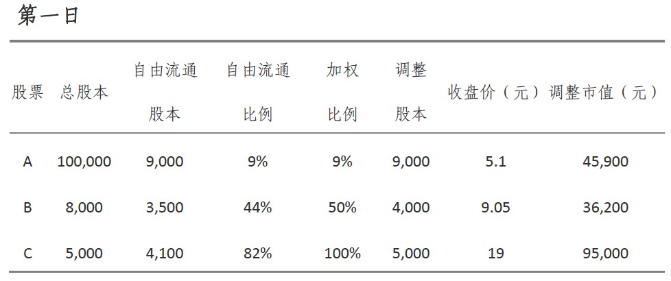
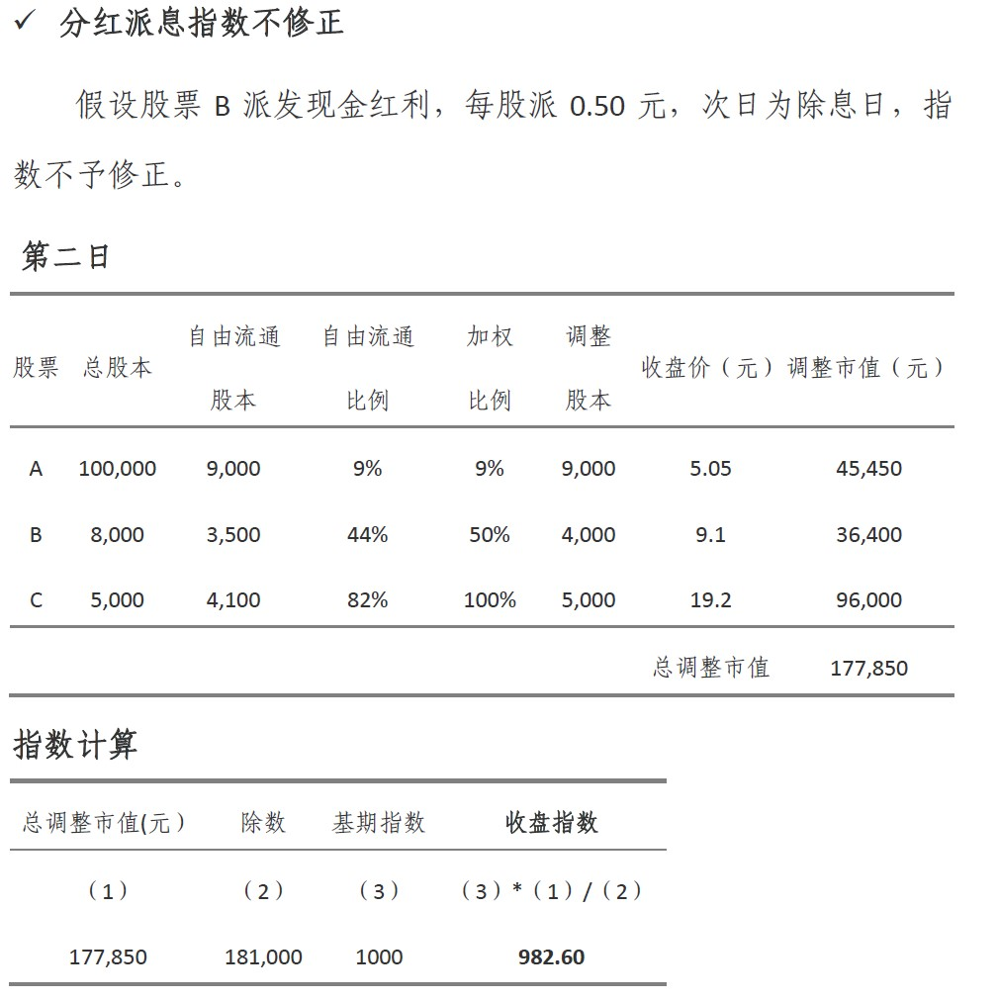

# 目录
一、指数计算相关概念	
1.1指数计算	
1.2指数的实时计算	
1.3指数具体计算方法	
1.3.1相对法	
1.3.2综合法	
1.3.3加权法	
1.4指数计算说明（示例）	
二、具体股票指数	
2.1上证50指数	
2.2.1计算公式	
2.2.2样本调整	
2.2.3指数的修正调整	
2.2中证500指数	
2.2.1样本选取	
2.2.2选样方法	
2.2.3指数计算	
2.2.4指数调整	
2.2.5指数修正	
2.3沪深300指数	
2.3.1样本选择	
2.3.2指数计算	
2.4其他指数	
2.4.1中证指数有限公司及其指数	
2.4.2上海证券交易所的股价指数	
2.4.3深圳证券交易所的股价指数	
2.4.4香港和台湾的主要股价指数	

 

<!--more-->
# 一、指数计算相关概念
## 1.1指数计算
股票指数提供收盘指数计算，部分股票指数提供实时指数计算。指数计算基于交易价格数据和基本信息数据，所有的数据均为公开或通过支付对价可获得的公平数据。不存在依靠人为经验对指数编制所使用的数据进行处理或人为剔除符合要求的数据的情形。

## 1.2指数的实时计算
具体做法是，在每一交易日集合竞价结束后，用集合竞价产生的股票开盘价(无成交者取行情系统提供的开盘参考价)计算开盘指数， 以后每5 秒重新发布一次指数，直至收盘。其中各样本股的计算价位(X)根据以下原则确定： 
若当日没有成交，则 X ＝开盘参考价
若当日有成交，则 X ＝最新成交价。
当沪深证券交易所行情发生异常情况时，中证指数有限公司视情况决定是否继续计算指数。 
其他股票指数的实时计算，样本股实时成交价格及实时汇率来自由中证指数有限公司不时指定的数据供应商提供的交易行情。

## 1.3指数具体计算方法
股票指数是反映不同时点上股价变动情况的相对指标。通常是将报告期的股票价格与定的基期价格相比，并将两者的比值乘以基期的指数值，即为该报告期的股票指数。股票指数的计算方法有三种：一是相对法，二是综合法，三是加权法。
计算股票指数时，往往把股票指数和股价平均数分开计算。按定义，股票指数即股价平均数。但从两者对股市的实际作用而言，股价平均数是反映多种股票价格变动的一般水平，通常以算术平均数表示。人们通过对不同的时期股价平均数的比较，可以认识多种股票价格变动水平。而股票指数是反映不同时期的股价变动情况的相对指标，也就是将第一时期的股价平均数作为另一时期股价平均数的基准的百分数。通过股票指数，人们可以了解计算期的股价比基期的股价上升或下降的百分比率。由于股票指数是一个相对指标，因此就一个较长的时期来说，股票指数比股价平均数能更为精确地衡量股价的变动。
### 1.3.1相对法
相对法又称平均法，就是先计算各样本股票指数。再加总求总的算术平均数。其计算公式为：
股票指数=n个样本股票指数之和/n 英国的《经济学人》普通股票指数就使用这种计算法。
### 1.3.2综合法
综合法是先将样本股票的基期和报告期价格分别加总，然后相比求出股票指数。即：
股票指数=报告期股价之和/基期股价之和
代入数字得：
股价指数=(8+12+14+18)/(5+8+10+15) = 52/38=136.8%
即报告期的股价比基期上升了36.8%。
从平均法和综合法计算股票指数来看，两者都未考虑到由各种采样股票的发行量和交易量的不相同，而对整个股市股价的影响不一样等因素，因此，计算出来的指数亦不够准确。为使股票指数计算精确，则需要加入权数，这个权数可以是交易量，亦可以是发行量。
### 1.3.3加权法
加权股票指数是根据各期样本股票的相对重要性予以加权，其权数可以是成交股数、股票发行量等。按时间划分，权数可以是基期权数，也可以是报告期权数。以基期成交股数(或发行量)为权数的指数称为拉斯拜尔指数；以报告期成交股数(或发行量)为权数的指数称为派许指数。
拉斯拜尔指数偏重基期成交股数(或发行量)，而派许指数则偏重报告期的成交股数(或发行量)。目前世界上大多数股票指数都是派许指数。

## 1.4指数计算说明（示例）
假定选择三个股票作为样本股计算指数，以基日股票调整市值为基值，基点指数定为1000 点。

 
 
 

<!--其他情况详见 股票指数计算与维护细则.pdf 附录五-->

# 二、具体股票指数
重点介绍上证50 中证500 沪深300，这三种股票指数的理解如下：
首先， **上证50**代表的是上海证券市场规模大、流动性好、最具代表性的50只股票组成的样本股，可以综合反映上交所最具影响力的一批龙头企业的整体状况。可以把上交所看成一个学校，“上证50”就是这个学校里德智体美劳各项表现最好的50个学生。
再来看**沪深300**，它是由沪深市场规模最大、流动性最好的300只股票组成，行业覆盖广泛并且相当稳定。如果把沪深两市比作两所高等学院，那么“沪深300”就是这两所高等学院中家境最好，成绩优异的尖子生。
最后再看中证500，它是由沪深两市排名第301至800的公司股票构成，用来综合反映沪深证券市场内中小市值公司的整体状况。中证500指数主攻沪深两市中小盘股，也就是沪深两市的这两所院校，在挑选完之前300个家境优渥的尖子生后，决定在剩下的小康家庭里再挑出500个“潜力股”。
## 2.1上证50指数
上证50指数是根据科学客观的方法，挑选上海证券市场规模大、流动性好的最具代表性的50只股票组成样本股，以综合反映上海证券市场最具市场影响力的一批优质大盘企业的整体状况。上证50指数，指数简称为上证50，指数代码000016，基日为2003年12月31日。
### 2.2.1计算公式
上证180和上证50指数以“点”为单位，精确到小数点后3位。上证180和上证50指数采用派许加权综合价格指数公式进行计算，计算公式如下：

***报告期指数=报告期成份股的调整市值×1000/基期***,

其中，调整市值 = Σ(股价×调整股本数)，基期亦称为除数。指数计算中的调整股本数系根据分级靠档的方法对样本股股本进行调整而获得。要计算调整股本数，需要确定自由流通量和分级靠档两个因素。当样本股名单、股本结构发生变化或样本股的调整市值出现非交易因素的变动时，采用"除数修正法"修正原除数，以保证指数的连续性。

### 2.2.2样本调整
上证50指数依据样本稳定性和动态跟踪相结合的原则，每半年调整一次成分股，调整时间与上证l80指数一致。特殊情况时也可能对样本进行临时调整。每次调整的比例一般情况不超过10%。样本调整设置缓冲区，排名在40名之前的新样本优先进入，排名在60名之前的老样本优先保留。

### 2.2.3指数的修正调整
为保证指数的连续性，当样本股名单发生变化或样本股的股本结构发生变化或样本股的市值出现非交易因素的变动时，上证180和上证50指数采用“除数修正法”修正原除数。上证180和上证50指数采用“除数修正法”修正，修正公式为：修正前的调整市值/原除数=修正后的调整市值/新除数,其中：修正后的调整市值=修正前的调整市值+新增（减）调整市值。由此公式得出新除数（即修正后的除数，又称新基期），并据此计算以后的指数。

## 2.2中证500指数
是中证指数有限公司所开发的指数中的一种，其样本空间内股票是由全部A股中剔除沪深300指数成份股及总市值排名前300名的股票后，总市值排名靠前的500只股票组成，综合反映中国A股市场中一批中小市值公司的股票价格表现。
### 2.2.1样本选取
样本空间:
上市时间超过一个季度，除非该股票自上市以来的日均A股总市值在全部沪深A股中排在前30位；
非ST、*ST、非暂停上市股票；
公司经营状况良好，最近一年无重大违法违规事件、财务报告无重大问题；
股票价格无明显的异常波动或市场操纵；
剔除其它经专家委员会认定不能进入指数的股票。
样本数量
中证500指数样本股数量为500只
### 2.2.2选样方法
按照以下步骤进行中证500指数的样本股选择：
步骤1 样本空间内股票扣除沪深300指数样本股即最近一年日均总市值排名前300名的股票；
步骤2 将步骤1中剩余股票按照最近一年（新股为上市以来）的日均成交金额由高到低排名，剔除排名后20%的股票；
步骤3 将步骤2中剩余股票按照日均总市值由高到低进行排名，选取排名在前500名的股票作为中证500指数样本股。
### 2.2.3指数计算
中证500、中证200、中证700和中证800指数的计算方法同沪深300指数。
计算方法:
沪深300指数以调整股本为权数，采用派许加权综合价格指数公式进行计算。其中，调整股本根据分级靠档方法获得。分级靠档方法如下表所示：
举例：某股票自由流通比例为7%，低于10%，则采用自由流通股本为权数；某股票自由流通比例为35%，落在区间(30，40]内，对应的加权比例为40%，则将总股本的40%作为权数。
注：自由流通比例是指公司总股本中剔除以下基本不流通的股份后的股本比例：①公司创建者、家族和高级管理者长期持有的股份；②国有股；③战略投资者持股；④冻结股份；⑤受限的员工持股；⑥交叉持股等。
计算公式：

***报告指数=市值报告期成份股的总调整/基期×1000***

其中：总调整市值=Σ(市价×样本股调整股本数)

### 2.2.4指数调整
中证500指数的样本股原则上每半年调整一次。每次调整的样本比例一般不超过10%。样本调整设置缓冲区，排名在400名内的新样本优先进入，排名在600名之前的老样本优先保留。
特殊情况下将对中证500指数样本进行临时调整。发生临时调整时，由过去最近一次指数定期调整时备选名单中排名最高的股票替代被剔除的股票。
当沪深300、中证100、中证500指数调整样本股时，中证200、中证700和中证800指数随之进行相应的调整。

### 2.2.5指数修正
中证200、中证500、中证700和中证800指数的指数修正方法同沪深300指数。
沪深300指数采用“除数修正法”修正。当样本股名单、股本结构发生变化或样本股的调整市值出现非交易因素变动时，采用“除数修正法”修正原固定除数，以保证指数的连续性。修正公式为：
修正前的调整市值/原除数 =修正后的调整市值/新除数
其中，修正后的调整市值=修正前的调整市值+新增（减）调整市值；由此公式得出新除数（即修正后的除数，又称新基期），并据此计算指数。

需要修正的情况包括：
除息：凡有样本股除息（分红派息），指数不予修正，任其自然回落；
除权：凡有样本股送股或配股，在样本股的除权基准日前修正指数。修正后调整市值=除权报价×除权后的股本数+修正前调整市值（不含除权股票）；
停牌：当某一样本股停牌，取其最后成交价计算指数，直至复牌；
摘牌：凡有样本股摘牌（终止交易），在其摘牌日前进行指数修正；
股本变动：凡有样本股发生股本变动（如增发新股、配股上市、内部职工股上市引起的股本变化等），在样本股的股本变动日前修正指数；
成份股名单发生变动时，在变动日前修正指数；
停市：部分样本股停市时，指数照常计算；全部样本股停市时，指数停止计算。

## 2.3沪深300指数
沪深300指数，是由沪深证券交易所于2005年4月8日联合发布的反映沪深300指数编制目标和运行状况的金融指标，并能够作为投资业绩的评价标准，为指数化投资和指数衍生产品创新提供基础条件。
### 2.3.1样本选择
指数成份股的选样空间，上市交易时间超过一个季度；非ST、*ST股票，非暂停上市股票；公司经营状况良好，最近一年无重大违法违规事件、财务报告无重大问题；股票价格无明显的异常波动或市场操纵；剔除其他经专家认定不能进入指数的股票。选样标准为选取规模大、流动性好的股票作为样本股。
选样方法为先计算样本空间股票在最近一年（新股为上市以来）的日均总市值、日均流通市值、日均流通股份数、日均成交金额和日均成交股份数五个指标，再将上述指标的比重按2：2：2：2：1进行加权平均，然后将计算结果从高到低排序，选取排名在前300位的股票。
### 2.3.2指数计算
指数以调整股本为权重。例如，某股票流通股比例（流通股本/总股本）为7%，低于10%，则采用流通股本为权数；某股票流通比例为35%，落在区间（30，40]内，对应的加权比例为40%，则将总股本的40%作为权数。
指数成份股原则上每半年调整一次，一般为1月初和7月初实施调整，调整方案提前两周公布。近一次财务报告亏损的股票原则上不进入新选样本，除非这只股票影响指数的代表性。
沪深300指数以2004年12月31日为基日，以该日300只成份股的调整市值为基期，基期指数定为1000点，自2005年4月8日起正式发布。
计算公式为：

***报告期指数=报告期成份股的调整市值/基日成份股的调整市值×1000***

其中，调整市值=∑（市价×调整股本数），基日成份股的调整市值亦称为除数，调整股本数采用分级靠档的方法对成份股股本进行调整。沪深300的分级靠档方法如下表所示：

 
另外，沪深300指数的选样方法是对样本空间股票在最近一年（新股为上市以来）的日均成交金额由高到低排名，剔除排名后50%的股票，然后对剩余股票按照日均总市值由高到低进行排名，选取排名在前300名的股票作为样本股。

## 2.4其他指数
中国主要的股票价格指数包括以下几种：
### 2.4.1中证指数有限公司及其指数 
（1）中证流通指数。中证指数有限公司于2006年2月27日正式发布中证流通指数。中证流通指数以2005年12月30日为基日，以该日所有样本股票的调整市值为基期，基点为1000点。
（2）沪深300指数。为放映中国证券市场股票价格变动的概貌和运行状况，并能够作为投资业绩的评价标准。为指数化投资及指数衍生产品创新提供基础条件，中证指数公司编制并发布了沪深300统一指数。
（3）中证规模指数。中证规模指数包括中证100指数，中证200指数，中证500指数，中证700指数，中证800指数。中证指数公司于2006年5月29日发布中证100指数。指数以沪深300指数样本股作为样本空间，样本数量100只，选样方法是亘古总市值对样本空间内股票进行排名，原则上挑选排名前100名的股票组成样本，但经专家委员会认定不宜作为样本的股票除外。指数以2005年12月30日为基日，基点为1000点。
### 2.4.2上海证券交易所的股价指数 
(1)样本指数类
①上证成分股指数。上证成分股指数，简称“上证l80指数”，是上海证券交易所对原上证30指数进行调整和更名产生的指数。上证成分股指数的编制方案是在结合中国证券市场的发展现状并借鉴国际经验，在原上证30指数编制方案的基础上作进一步完善后形成的。
②上证50指数。2004年1月2日，上海证券交易所发布了上证50指数。上证50指数根据流通市值、成交金额对股票进行综合排名，从上证l80指数样本中选择排名前50位的股票组成样本。指数以2003年12月31日为基日，以该日50只成分股的调整市值为基期，基数为l000点。上证50指数采用派许加权方法，按照样本股的调整股本数为权数进行加权计算。计算公式为：
报告期成分股的调整市值
　　报告期指数=————————————×1000
　　基期成分股的调整市值
其中，调整市值=∑(市价×调整股数)。
调整股本数采用流通股本占总股本比例分级靠档的方法对成分股股本进行调整。上证50指数的分级靠档方法同中证流通指数。当样本股名单发生变化、样本股的股本结构发生变化，或股价出现非交易因素的变动时，采用“除数修正法”修正原固定除数，以维护指数的连续性。
③上证红利指数。上证红利指数，简称“红利指数”，由上海证券交易所编制。上证红利指数由在上海证券交易所上市的现金股息率高、分红比较稳定的50只样本股组成，以反映上海证券市场高红利股票的整体状况和走势。在满足规模和流动性条件的基础上，按照过去两年平均税后股息率进行排名，挑选排名最前的50只股票组成样本股。上证红利指数以2004年l2月31日为基日，基点1000点，于2005年首个交易日发布。

(2)综合指数类。
　　①上证综合指数。上海证券交易所从l991年7月15日起编制并公布上海证券交易所股价指数，它以1990年12月19日为基期，以全部上市股票为样本，以股票发行量为权数，按加权平均法计算。其计算公式为：
本日股票市价总值
　　本日股价指数=—————————x l00
　　基期股票市价总值
式中：本日股票市价总值=∑本日收盘价×发行股数；
　　2007年1月上海证券交易所宣布，新股于上市第11个交易日开始计入上证综指、新综指及相应上证A股、上证B股、上证分类指数，从而进一步完善指数编制规则，使指数更真实地反映市场的平均收益水平。
　　②新上证综指。新上证综指，简称为“新综指”，指数代码为000017,于2006年1月4日首次发布。新上证综指选择已完成股权分置改革的沪市上市公司组成样本，实施股权分置改革的股票在方案实施后的第2个交易日纳人指数。新上证综指是一个全市场指数，它不仅包括A股市值，对于含B股的公司，其B股市值同样计算在内。新上证综指以2005年12月30日为基日，以该日所有样本股票的总市值为基期，基点为1000点。新上证综指采用派许加权方法，以样本股的发行股本数为权数进行加权计算。
　　(3)分类指数类。上证分类指数有A股指数、B股指数及工业类、商业类、地产类、公用事业类、综合类，共7类。
　　上证A股指数以l990年12月19日为基期，设基期指数为100点，以全部上市的A股为样本，以市价总值加权平均法编制。上证8股指数以1992年2月21日为基期，设基期指数为100点，以美元为计价单位，以全部上市的8股为样本，以市价总值加权平均法编制。
　　上海证券交易所按全部上市公司的主营范围、投资方向及产出分别计算工业类、商业类、地产类、公用事业类和综合类分类指数。上证工业类指数、商业类指数、地产类指数、公用事业类指数、综合类指数均以1993年4月30日为基期，基期指数设为1 358．78点，于1993年5月3日正式对外公布。以在上海证券交易所上市的全部工业类股票、商业类股票、地产类股票、公用事业类股票、综合类股票为样本，以全部发行股数为权数进行计算。

### 2.4.3深圳证券交易所的股价指数 
(1)样本指数类。
①深证成分股指数。深证成分股指数由深圳证券交易所编制，通过对所有在深圳证券交易所上市的公司进行考察，按一定标准选出40家有代表性的上市公司作为成分股，以成分股的可流通股数为权数，采用加权平均法编制而成。成分股指数以1994年7月20日为基日，基日指数为l000点，起始计算日为1995年1月25日。深圳证券交易所选取成分股的一般原则是：有一定的上市交易时间；有一定的上市规模，以每家公司一段时期内的平均可流通股市值和平均总市值作为衡量标准；交易活跃，以每家公司一段时期内的总成交金额和换手率作为衡量标准。根据以上标准，再结合下列各项因素评选出成分股：公司股票在一段时间内的平均市盈率，公司的行业代表性及所属行业的发展前景，公司近年来的财务状况、盈利记录、发展前景及管理素质等，公司的地区、板块代表性等。
　　②深证A股指数。深圳A股指数以成分A股为样本，以成分A股的可流通股数为权数，采用加权平均法编制而成。成分A股指数以l994年7月20日为基日，基日指数为l000点，起始计算日为l995年1月25日。
　　③深证B股指数。深圳8股指数以成分8股为样本，以成分8股的可流通股数为权数，采用加权平均法编制而成。成分8股指数以l994年7月20日为基日，基日指数为l000点，起始计算日为l995年1月25日。
　　④深证100指数。深圳证券信息有限公司于2003年初发布深证l00指数。深证l00指数成分股的选取主要考察A股上市公司流通市值和成交金额两项指标，从在深交所上市的股票中选取l00只A股作为成分股，以成分股的可流通A股数为权数，采用派许综合法编制。根据市场动态跟踪和成分股稳定性原则，深证l00指数将每半年调整一次成分股。深证l00指数以2002年12月31日为基准日，基准指数定为l000点，从2003年第l个交易日开始编制和发布。
(2)综合指数类。
　　①深证综合指数。深圳证券交易所综合指数包括：深证综合指数、深证A股指数和深证8股指数。它们分别以在深圳证券交易所上市的全部股票、全部A股、全部8股为样本股，以1991年4月3日为综合指数和A股指数的基期，以1992年2月28日为8股指数的基期，基期指数定为100，以指数股计算日股份数为权数进行加权平均计算。当有新股票上市时，在其上市后第2天纳入指数计算。当某一股票暂停买卖时，将其暂时剔除于指数的计算之外。若有某一股票在交易中突然停牌，将取其最后成交价计算即时指数，直至收市。
(3)分类指数类。深证分类指数包括农林牧渔指数、采掘业指数、制造业指数、水电煤气指数、建筑业指数、运输仓储指数、信息技术指数、批发零售指数、金融保险指数、房地产指数、社会服务指数、传播文化指数、综企类指数共13类。其中，制造业指数又分为食品饮料指数、纺织服装指数、木材家具指数、造纸印刷指数、石化塑胶指数、电子指数、金属非金属指数、机械设备指数、医药生物指数等9类。深证分类指数以1991年4月3目为基期，基期指数设为1000点，起始计算l3为2001年7月2日。

### 2.4.4香港和台湾的主要股价指数
(1)恒生指数。恒生指数是由香港恒生银行于l969年11月24日起编制公布、系统反映香港股票市场行情变动最有代表性和影响最大的指数。它挑选了33种有代表性的上市股票为成分股，用加权平均法计算。成分股主要根据以下四个标准选定：第一，股票在市场上的重要程度；第二，股票成交额对投资者的影响；第三，股票发行在外的数量能应付市场旺盛时的需要；第四，公司的业务应以香港为基地。这33种成分股中包括金融业4种、公用事业6种、地产业9种、其他工商业14种。这些股票分布在香港主要行业，都是最具代表性和实力雄厚的大公司。它们的市价总值要占香港所有上市股票市价总值的70%左右。恒生指数的成分股并不固定，自1969年以来，已作了10多次调整，从而使成分股更具有代表性，使恒生指数更能准确反映市场变动状况。
　　恒生指数最初以股市交易较正常的1964年7月31日为基期，令基值为100，后来因为恒生指数按行业增设了4个分类指数，将基期改为1984年1月13日，并将该日收市指数的975．47点定为新基期指数。由于恒生指数具有基期选择恰当、成分股代表性强、计算频率高、指数连续性好等特点，因此一直是反映和衡量香港股市变动趋势的主要指标。
　　香港恒生指数成分股编制规则沿用37年，于2006年2月提出改制，首次将H股纳入恒生指数成分股。上市标准是以H股形式于香港上市的内地企业，只要公司的股本以全流通形式于香港联交所上市；H股公司已完成股权分置，且无非上市股本；或者新上市的H股公司无非上市股本。恒生指数服务公司表示，恒生指数会增加成分股数目，由目前的33只逐步增加至38只，新增加的5只将全部是国企股。截至2006年末，中国建设银行、中国石化、中国银行已人选恒指成分股，恒生指数成分股数目由原来的33只增加至36只。2007年3月12日起将工行、中国人寿纳入恒生指数，至此，恒生指数成分股增加至38只。这也意味着上证综指的前四大权重股工商银行、中国人寿、中国银行和中国石化全部进人恒生指数系列。除首度将H股纳入恒指成分股外，恒生指数的编算方法也将出现变动：由总市值加权法改为以流通市值调整计算，并为成分股设定l5%的比重上限。近年来，国企股占港股总市值和成交额的比重不断上升，变动后的恒生指数更能全面反映市况，更具市场代表性。
　　(2)恒生综合指数系列。恒生银行于2001年10月3日推出恒生综合指数系列。恒生综合指数包括200家市值最大的上市公司，并分为两个独立指数系列，即地域指数系列和行业指数系列。地域指数分为恒生香港综合指数和恒生中国内地指数。其中，恒生香港综合指数包括123家在香港上市而营业收益主要来自中国内地以外地方的公司，义分为恒生香港大型股指数、恒生香港中型股指数和恒生香港小型股指数。恒生中国内地指数包括77家在香港上市而营业收益主要来自中国内地的公司，叉分为恒生中国企业指数(H股指数)和恒生中资企业指数(红筹股指数)。恒生综合行业指数分为资源矿产业指数、工业制造业指数、消费品制造业指数、服务业指数、公用事业指数、金融业指数、地产建筑业指数、咨询科技业指数、综合企业指数。
　　(3)恒生流通综合指数系列。恒生流通综合指数系列于2002年9月23日推出，以恒生综合指数系列为编制基础，与恒生综合指数相同，有200只成分股，并对成分股流通量作出调整。在指数编制过程中，整个指数系列均经过流通量市值及市值比重上限调整。流通市值调整的目的是在指数编制中剔除由策略性股东长期持有并不在市场流通的股票。以下三类股份被视为策略性持有的股份：①策略性股东持有的股权，由一位或多位策略性股东单独或共同持有超过30%的股权；②董事持有的股权，个另0董事持有超过5%的股权；③互控公司持有的股权，由一家香港上市公司所持有并超过5%的股权。流通市值调整的依据是公开资料，包括公司年报和香港交易所提供的公开信息。流通量调整系数(流通系数)是流通股份占总发行股份的百分率。各成分股的发行股票数量以流通系数调整后才用以编制指数。流通系数将调整至最接近的5%或l0%的整位数，各成分股占指数的比重均调整至不超过15%。恒生流通综合指数系列以2000年1月3日为基期，并以2 000点为基值。
　　(4)恒生流通精选指数系列。恒生流通精选指数系列于2003年1月20日推出。恒生流通精选指数系列由“恒生50”、“恒生香港25”和“恒生中国内地25”组成，这3只指数分别为“恒生流通综合指数”、“恒生香港流通指数”和“恒生中国内地流通指数”属下的分组指数。
　　(5)台湾证券交易所发行量加权股价指数。台湾证券交易所目前发布的股价指数中，以发行股数加权计算的有26种，包括发行量加权股价指数(未含金融股发行量加权股价指数，未含电子股发行量加权股价指数)；还有22种产业分类股价指数，与英国富时(FTSE)共同编制的台湾50指数，以及以算术平均法计算的综合股价平均数和工业指数平均数。

### 2.4.5海外上市公司指数
2004年10月18日美国芝加哥期权交易所(CBOE)的全资子公司CBOE期货交易所(CFE)推出CBOE中国指数，并以该指数为标的推出CBOE中国指数期货，还计划推出中国指数期权。
　　CBOE推出的中国指数主要基于海外上市的中国公司，以在纽约证券交易所、纳斯达克证券市场或美国证券交易所上市的l6只中国公司股票为样本，按照等值美元加权平均计算而成。样本股有中国铝业(ACH．NYSE)、中国人寿(LFC．NYSE)、中国电信(CHA．NYSE)、中国移动(CHU．NYSE)、中海油(CE0．NYSE)、中国玉柴国际(CYD．NYSE)、华能国际(HNE NYSE)、南太电子(NTE．NYSE)、中石油(PTR．NYSE)、新浪网(SINA．NASDAQ)、中石化(SNP．NYSE)、搜狐网(SOHU．NASDAQ)、网易(NTES．NASDAQ)、中华网(CHINA．NASDAQ)、UT斯达康(UTSl．NASDAQ)等。
　　中国指数期货是标准化合约，代号为CX，交易时间为芝加哥时间8：30。15：15，交易平台为CBOEdimct电子交易平台。合约标准为每点l00美元．最小变动价位为0．05点，合约结算日为到期月的第3个星期五，采用现金结算。

